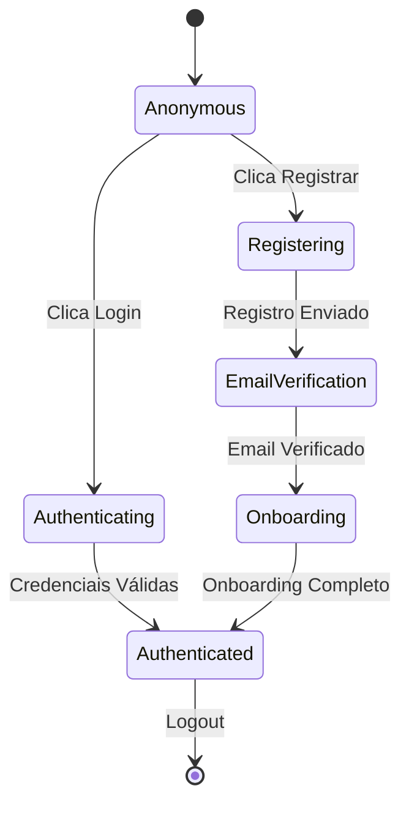

# Study Space - Fluxo Atual do Usuário 📊

## 📋 Visão Geral

Este documento mapeia de forma detalhada o fluxo completo do usuário na plataforma Study Space atual, identificando todos os pontos de interação, estados do sistema e experiência do usuário desde o primeiro acesso até o uso avançado da plataforma.

## 🏗️ Arquitetura Atual do Sistema

### **Stack Tecnológico**

```
Frontend:
├── React 18 + TypeScript + Vite
├── Radix UI Components + Tailwind CSS
├── React Query (Server State Management)
├── React Router (Navegação)
├── Context API (Auth State)
├── Socket.io-client (Real-time)
└── React Hook Form + Zod (Validação)

Backend:
├── Node.js + Express
├── PostgreSQL (Database)
├── JWT + bcrypt (Authentication)
├── Socket.io (WebSocket Server)
├── Passport.js (OAuth)
├── Nodemailer (Email Service)
└── Rate Limiting + CORS
```

### **Estrutura de Diretórios**

```
src/
├── components/
│   ├── Auth/ (LoginForm, RegisterForm, VerificationForm)
│   ├── Community/ (CommunityGrid, CommunityDetail)
│   ├── Post/ (PostCreator, PostCard, PostStats)
│   ├── Profile/ (ProfilePostsSection, UserPostsList)
│   ├── StudyApp/ (Header, MainArea, Toolbar)
│   └── ui/ (Radix UI Components)
├── contexts/
│   ├── AuthContext.tsx
│   └── StudyAppContext.tsx
├── hooks/
│   ├── usePosts.tsx
│   ├── useConversations.tsx
│   └── use-mobile.tsx
├── pages/
│   ├── Auth.tsx
│   ├── Feed.tsx
│   ├── Comunidades.tsx
│   └── SalaEstudo.tsx
└── adapters/
    └── SupabaseClientAdapter.ts
```

## 🎯 Jornada Completa do Usuário

### **1. DESCOBERTA E PRIMEIRO ACESSO**

#### **1.1 Landing Experience**

```
Estado: Usuário Anônimo
URL: https://studyspace.com/
```

**Fluxo:**

1. **Carregamento da Página**

   - Renderização da página de login/registro
   - Verificação de token existente no localStorage
   - Redirecionamento automático se autenticado

2. **Opções de Entrada**
   - Registro com email/senha
   - Login com credenciais existentes
   - OAuth (Facebook, Google, GitHub)

#### **1.2 Processo de Registro**

```
Componente: RegisterForm.tsx
API Endpoint: POST /api/auth/register
Estado: user_registering
```

**Dados Coletados:**

- Email (obrigatório, validação de formato)
- Senha (mínimo 8 caracteres, validação de força)
- Nickname (único, validação de disponibilidade)
- Nome completo

**Validações Frontend:**

```typescript
const registerSchema = z.object({
  email: z.string().email("Email inválido"),
  password: z.string().min(8, "Mínimo 8 caracteres"),
  nickname: z.string().min(3, "Mínimo 3 caracteres"),
  name: z.string().optional(),
});
```

**Fluxo de Validação:**

1. Validação em tempo real (Zod + React Hook Form)
2. Verificação de email/nickname disponível (API call)
3. Submissão do formulário
4. Geração de token de verificação
5. Envio de email de confirmação

#### **1.3 Verificação de Email**

```
Componente: VerificationForm.tsx
API Endpoint: POST /api/auth/verify-email
Estado: email_verification_pending
```

**Processo:**

1. **Email Enviado**

   - Template personalizado via Nodemailer
   - Link com token temporário (24h)
   - Instruções de verificação

2. **Verificação**
   - Click no link do email
   - Validação do token no backend
   - Ativação da conta
   - Redirecionamento para onboarding

### **2. ONBOARDING E PRIMEIRA EXPERIÊNCIA**

#### **2.1 Modal de Onboarding**

```
Componente: OnboardingModal.tsx
Estado: first_time_user
Trigger: user.is_new === true
```

**Etapas do Onboarding:**

1. **Boas-vindas**

Usuário escolhe um nickname único
Usuário escolhe um avatar

#### **2.2 Estado Pós-Onboarding**

```
Context Update: AuthContext
Local Storage: user_profile, preferences
Estado: active_user
```

### **3. NAVEGAÇÃO PRINCIPAL**

#### **3.1 Layout Base**

```
Componente: App.tsx → ProtectedRoute → Layout
Estado: authenticated_user
```

**Estrutura da Interface da página feed:**

```
┌─────────────────────────────────────────┐
│ Header (Navegação + Perfil + Chat)      │
├─────────────────────────────────────────┤
│ Sidebar     │ Main Content │ RightSide  │
│ (Navegação) │ (Feed/Page)  │ (Sugest.)  │
│             │              │            │
│ - Feed      │              │ - Online   │
│ - Comunid.  │              │ - Sugest.  │
│ - Amigos    │              │ - Eventos  │
│ - Perfil    │              │            │
└─────────────────────────────────────────┘
```

#### **3.2 Sistema de Roteamento**

```typescript
Routes:
/feed          → Feed.tsx (Homepage autenticada)
/comunidades   → Comunidades.tsx (Lista de comunidades)
/amigos        → Amigos.tsx (Gerenciar conexões)
/perfil        → Perfil.tsx (Perfil pessoal)
/perfil/:id    → PublicProfile.tsx (Perfil público)
/sala-estudo   → SalaEstudo.tsx (Sala de estudos)
/questoes      → Questoes.tsx (Banco de questões)
/aulas         → Aulas.tsx (Conteúdo educacional)
```

### **4. FEED PRINCIPAL E INTERAÇÕES**

#### **4.1 Carregamento do Feed**

```
Componente: Feed.tsx
Hook: usePosts(), useInfinitePosts()
API: GET /api/posts/feed
Estado: feed_loading → feed_ready
```

**Processo de Carregamento:**

1. **Inicialização**

   - Verificação de autenticação
   - Busca de posts iniciais (20 itens)
   - Configuração de scroll infinito

2. **Estrutura dos Posts**
   ```typescript
   interface Post {
     id: string;
     user_id: string;
     type: "publicacao" | "duvida" | "exercicio" | "enquete";
     content: string;
     media_urls?: string[];
     tags: string[];
     likes_count: number;
     comments_count: number;
     created_at: string;
     poll_data?: PollData;
     exercise_data?: ExerciseData;
   }
   ```

#### **4.2 Tipos de Posts e Interações**

##### **Posts de Publicação**

```
Componente: PostCard.tsx
Interações: Like, Comentar, Compartilhar
```

**Ações Disponíveis:**

- **Like/Unlike**

  - Endpoint: POST/DELETE /api/posts/:id/like
  - Atualização otimista da UI
  - Contador em tempo real

- **Comentários**
  - Expandir/colapsar seção
  - Adicionar comentário
  - Responder a comentários
  - Sistema de likes em comentários

##### **Posts de Dúvida**

```
Funcionalidade: Q&A System
Estado: question_post
```

**Características Específicas:**

- Marcação como "Dúvida"
- Sistema de respostas hierárquico
- Marcação de melhor resposta
- Categorização por disciplina/área

##### **Posts de Exercício**

```
Componente: ExercisePost.tsx
Hook: useExerciseResponse()
API: POST /api/posts/:id/exercise-response
```

**Estrutura:**

- Enunciado da questão
- Múltiplas opções (A, B, C, D, E)
- Sistema de votação
- Revelação da resposta correta
- Estatísticas de acertos

##### **Posts de Enquete**

```
Componente: PollPost.tsx
Hook: usePollVote()
API: POST /api/posts/:id/poll-vote
```

**Funcionalidades:**

- Múltiplas opções de resposta
- Votação única por usuário
- Resultados em tempo real
- Gráficos de barras
- Prazo de expiração (opcional)

#### **4.3 Criação de Posts**

```
Componente: PostCreator.tsx
Modal: CreatePostModal.tsx
Estados: composing → publishing → published
```

**Processo de Criação:**

1. **Seleção do Tipo**

   - Publicação simples
   - Dúvida
   - Exercício
   - Enquete

2. **Composer Interface**

   ```
   ┌─────────────────────────────────────┐
   │ [Avatar] [Tipo de Post ▼]           │
   ├─────────────────────────────────────┤
   │ Texto do post...                    │
   │                                     │
   │ [📷 Mídia] [🏷️ Tags] [📍 Local]    │
   ├─────────────────────────────────────┤
   │ [Cancelar]              [Publicar]  │
   └─────────────────────────────────────┘
   ```

3. **Validações e Upload**
   - Validação de conteúdo (min/max caracteres)
   - Upload de imagens/vídeos
   - Processamento de tags
   - Publicação com feedback visual

### **5. SISTEMA SOCIAL E CONEXÕES**

#### **5.1 Sistema de Amizades**

```
Página: Amigos.tsx
API Endpoints:
- GET /api/connections/requests
- POST /api/connections/send-request
- PUT /api/connections/accept/:id
- DELETE /api/connections/reject/:id
```

**Estados das Conexões:**

- `pending_sent`: Solicitação enviada
- `pending_received`: Solicitação recebida
- `accepted`: Amigos conectados
- `blocked`: Usuário bloqueado

**Interface de Gerenciamento:**

```
Abas:
├── Amigos (Lista de conexões aceitas)
├── Solicitações (Pendentes de aprovação)
├── Enviadas (Aguardando resposta)
└── Sugestões (Baseado em interesses)
```

#### **5.2 Notificações Sociais**

```
Hook: useNotifications()
API: GET /api/notifications
WebSocket: notification_received
```

**Tipos de Notificações:**

- Solicitação de amizade recebida
- Solicitação aceita
- Novo comentário em post
- Like em post/comentário
- Menção em post
- Nova mensagem no chat

### **6. SISTEMA DE CHAT EM TEMPO REAL**

#### **6.1 Arquitetura WebSocket**

```
Frontend: Socket.io-client
Backend: Socket.io server
Namespace: /chat
```

**Eventos Socket:**

```typescript
// Cliente → Servidor
'join_conversation': conversationId
'send_message': { conversationId, message, type }
'typing_start': conversationId
'typing_stop': conversationId
'user_online': userId

// Servidor → Cliente
'message_received': MessageData
'typing_indicator': { userId, conversationId }
'user_status_update': { userId, status }
'conversation_updated': ConversationData
```

#### **6.2 Interface de Chat**

```
Componente: ChatWidget.tsx (Flutuante)
Estados: minimized → expanded → conversation_view
```

**Funcionalidades:**

- Lista de conversas ativas
- Indicadores de mensagens não lidas
- Status online/offline em tempo real
- Typing indicators
- Histórico de mensagens
- Envio de mídia
- Busca em conversas

### **7. COMUNIDADES E GRUPOS**

#### **7.1 Descoberta de Comunidades**

```
Página: Comunidades.tsx
Componente: CommunityGrid.tsx
API: GET /api/communities
```

**Categorias de Comunidades:**

- Disciplinas acadêmicas
- Cursos específicos
- Grupos de estudo
- Interesse geral
- Universidades/instituições

**Filtros Disponíveis:**

- Por categoria
- Por popularidade
- Por atividade recente
- Por localização

#### **7.2 Participação em Comunidades**

```
Componente: CommunityDetail.tsx
Estados: public → member → moderator → admin
```

**Níveis de Acesso:**

- **Visitante**: Visualizar posts públicos
- **Membro**: Postar, comentar, participar
- **Moderador**: Gerenciar posts, usuários
- **Admin**: Configurações completas

### **8. SALA DE ESTUDOS**

#### **8.1 Interface de Estudos**

```
Página: SalaEstudo.tsx
Componente: SalaEstudoInterface.tsx
Estado: study_session_active
```

**Funcionalidades Atuais:**

- Timer de estudos (Pomodoro básico)
- Anotações em tempo real
- Lista de tarefas
- Controle de foco
- Estatísticas de sessão

#### **8.2 Recursos Educacionais**

```
Página: Questoes.tsx, Aulas.tsx
Componentes: QuestionStats.tsx, LessonCard.tsx
```

**Banco de Questões:**

- Filtrar por disciplina
- Nível de dificuldade
- Estatísticas de acertos
- Histórico de respostas

**Aulas e Conteúdo:**

- Vídeo-aulas categorizadas
- Material de apoio (PDFs)
- Quiz integrado
- Progresso de visualização

### **9. PERFIL E PERSONALIZAÇÃO**

#### **9.1 Perfil Pessoal**

```
Página: Perfil.tsx
Seções: Informações, Posts, Atividade, Estatísticas
```

**Informações Editáveis:**

- Foto de perfil
- Bio/descrição
- Localização
- Curso/instituição
- Links sociais
- Interesses acadêmicos

#### **9.2 Posts e Atividade**

```
Componente: ProfilePostsSection.tsx, UserPostsList.tsx
Filtros: Todos, Publicações, Dúvidas, Exercícios, Enquetes
```

**Métricas Visíveis:**

- Total de posts publicados
- Curtidas recebidas
- Comentários feitos
- Exercícios respondidos
- Tempo total de estudos

### **10. CONFIGURAÇÕES E PREFERÊNCIAS**

#### **10.1 Configurações de Conta**

```
Modal: AccountSettings
API: PUT /api/profile/settings
```

**Opções Disponíveis:**

- Alterar senha
- Verificação em duas etapas
- Email de notificações
- Privacidade do perfil
- Excluir conta

#### **10.2 Preferências de Conteúdo**

- Tipos de posts no feed
- Notificações push
- Frequência de emails
- Idioma da interface
- Tema escuro/claro

## 🔄 Estados e Transições

### **Estados Principais do Usuário**



### **Estados de Sessão**

- `loading`: Verificando autenticação
- `anonymous`: Usuário não logado
- `authenticating`: Processo de login
- `authenticated`: Sessão ativa
- `expired`: Token expirado
- `error`: Erro de conexão

### **Estados de Conteúdo**

- `loading`: Carregando dados
- `ready`: Conteúdo disponível
- `error`: Falha no carregamento
- `offline`: Sem conexão
- `syncing`: Sincronizando mudanças

## 📊 Métricas e Analytics Atuais

### **Eventos Rastreados**

```typescript
// Eventos de Autenticação
'user_registered': { method: 'email' | 'oauth', provider?: string }
'user_logged_in': { method: 'email' | 'oauth', provider?: string }
'user_logged_out': { session_duration: number }

// Eventos de Conteúdo
'post_created': { type: 'publicacao' | 'duvida' | 'exercicio' | 'enquete' }
'post_liked': { post_id: string, author_id: string }
'comment_created': { post_id: string, parent_id?: string }

// Eventos Sociais
'friend_request_sent': { recipient_id: string }
'friend_request_accepted': { sender_id: string }
'message_sent': { conversation_id: string, message_type: 'text' | 'media' }

// Eventos de Estudo
'study_session_started': { planned_duration: number }
'study_session_completed': { actual_duration: number, breaks: number }
'exercise_answered': { post_id: string, correct: boolean, time_taken: number }
```

### **KPIs Monitorados**

- **Engajamento**

  - DAU (Daily Active Users)
  - Tempo médio de sessão
  - Posts por usuário/dia
  - Interações por post

- **Retenção**

  - D1, D7, D30 retention
  - Churn rate
  - Frequência de uso

- **Social**
  - Conexões por usuário
  - Mensagens enviadas
  - Participação em comunidades

## 🚨 Pontos de Atrito Identificados

### **Problemas de UX Atuais**

1. **Onboarding Longo**

   - Muitas etapas obrigatórias
   - Falta de opção "pular"
   - Não salva progresso

2. **Feed Pouco Personalizado**

   - Algoritmo básico cronológico
   - Falta de filtros avançados
   - Pouco conteúdo relevante

3. **Chat Interface Limitada**

   - Apenas texto básico
   - Sem histórico de busca
   - Notificações inconsistentes

4. **Mobile Experience Deficiente**
   - Interface não otimizada
   - Performance lenta
   - Funcionalidades limitadas

### **Limitações Técnicas**

1. **Escalabilidade**

   - WebSocket não clusterizado
   - Sem cache de dados
   - Query N+1 em alguns endpoints

2. **Performance**

   - Bundle size grande
   - Imagens não otimizadas
   - Sem lazy loading consistente

3. **Offline Support**
   - Nenhuma funcionalidade offline
   - Perda de dados em desconexão
   - Sync conflicts não tratados

## 🎯 Oportunidades de Melhoria

### **Imediatas (Sprint Atual)**

1. Otimização do onboarding
2. Melhoria na performance do feed
3. Fix de bugs críticos no chat
4. Implementação de cache básico

### **Curto Prazo (Q1 2025)**

1. Sistema de stories
2. Reações expandidas
3. Algoritmo de feed melhorado
4. App mobile nativo

### **Médio Prazo (Q2-Q3 2025)**

1. Gamificação completa
2. Salas de estudo colaborativas
3. Sistema de mentoria
4. Analytics avançados

---

**Documento Atualizado:** 27 Agosto 2025  
**Próxima Revisão:** 15 Setembro 2025  
**Versão:** 1.0

_Este documento serve como base para o desenvolvimento das novas funcionalidades mapeadas no roadmap 2025, garantindo continuidade da experiência atual._
